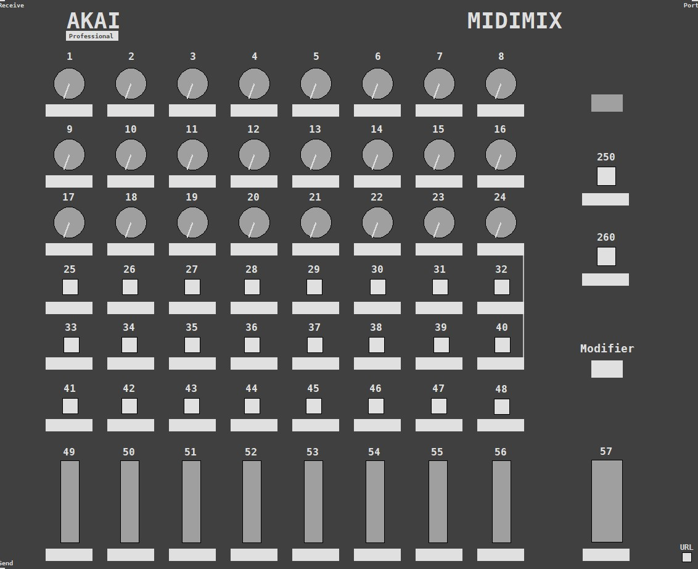

# Akai-Midimix-abstraction
GOP abstraction for the Akai Midimix controller for plug and play use on Pure Data.

🎚️ Akai MIDImix Abstraction for Pure Data
[akai.midimx] is a plug-and-play abstraction designed for the Akai MIDImix MIDI controller in Pure Data, with full compatibility for PlugData. Featuring a clean GOP layout, it integrates seamlessly into any patch for intuitive mixer-style control.

This abstraction builds on the previous [korg.nanokontrol2] design, adapted for Akai MIDImix — a controller without transport buttons but packed with faders, knobs, and mute switches.

⚙️ Features
🧩 Single-argument instantiation Just use the MIDI port number assigned in PD’s MIDI Settings.

🎛️ GOP-ready interface Embed in any parent patch with visual feedback and ease of control.

🌀 Plug-and-play workflow Instant connectivity with no manual mapping required.

💾 Savestate-friendly structure Works smoothly with patch saving across multiple instances.

🎧 Pure Data & PlugData compatible Flexible across environments and platforms.

🧰 Usage
To use the abstraction, place it in your patch like this:

puredata
[akai.midimx 1]
Where 1 is the MIDI port number corresponding to your Akai MIDImix in MIDI Settings.

📁 Included Files
akai.midimix.pd → main abstraction

akai.midimix-help.pd → help patch with preview layout

README.md → documentation file

Akai Editor template patch (recommended)

📝 Notes
🔢 It has only one creation argument: the MIDI port number, which must match the number selected in PD's MIDI Settings.

📦 Else library is necessary for certain functions.

🧿 Multiple instances of [akai.midimix] are possible, but the help patch should remain closed to avoid conflicts.

🎛️ Use the abstraction in conjunction with the provided Akai Editor patch for full functionality.

✅ It is recommended to set the controller in CC Generic Mode — press CYCLE + SET MARKET while connecting the device to activate it.

👤 Credits
Developed by Diego @ DSB AUDIO
